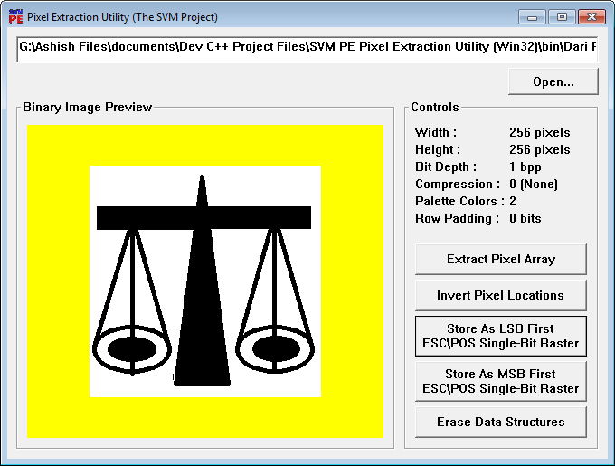

<h1>

SVM PE Pixel Extraction Utility Program
</h1>

An easy-to-use software which can extract <b>pixel data</b> from <b>1-bpp Monochrome Bitmaps</b>
and transform those extracted data into <b>ESC\POS Single-Bit Rasters</b>.

<h3>
 Printing Guidelines

</h3>

The single-bit raster image produced by SVM PE is generally <b>row-ordered</b>. That means, consecutive pixel data
inside the produced image are arranged in rows. So to print this raster image by Thermal POS printers,
the <b>most suitable ESC\POS</b> command would be:
  <b>GS v 0 m xL xH yL yH d1...dk</b>
 where <b>k = (xL + xH * 256) * (yL + yH * 256)</b>
 with the condition <b>k > 0</b> must hold

<h3>Download</h3>
<ul>
<li><b>
<a href="https://github.com/AKD92/SVM-PE-Pixel-Extraction-Utility-Program/raw/master/bin/svm_pe_x86.exe">
Standalone Executable (Win32)</a>
 Compiled using <a href="http://tdm-gcc.tdragon.net/about">TDM-GCC 5.1</a>
</b></li>
<li><b>
<a href="/src">Browse for Source Codes</a> on GitHub
</b></li>
<li><b>
<a href="/sample_images">Browse for Sample Bitmap Images</a> on GitHub
</b></li>
</ul>

<h3>Related Links</h3>
<ol>
<li><b>
<a href="http://content.epson.de/fileadmin/content/files/RSD/downloads/escpos.pdf">
ESC\POS Specification @ Epson</a>
</b></li>
<li><b>
<a href="https://en.wikipedia.org/wiki/Page_description_language">Page Description Language</a>
</b></li>
<li><b>
<a href="http://www.fileformat.info/format/bmp/egff.htm">Microsoft Windows BITMAP File Format Summary</a>
</b></li>
<li><b>
<a href="https://msdn.microsoft.com/en-us/library/windows/desktop/dd183376(v=vs.85).aspx">
Bitmap Header Structure @ MSDN Developer Resource</a>
</b></li>
</ol>

<h3>License</h3>
 This software is licensed under <a rel="license" href="http://www.gnu.org/licenses/gpl-3.0-standalone.html">GNU General Public License, Version 3</a>.

<a class="LI-simple-link" href='https://bd.linkedin.com/in/ashis-kr-das-3a1093113?trk=profile-badge'>Ashis Kr. Das</a>

