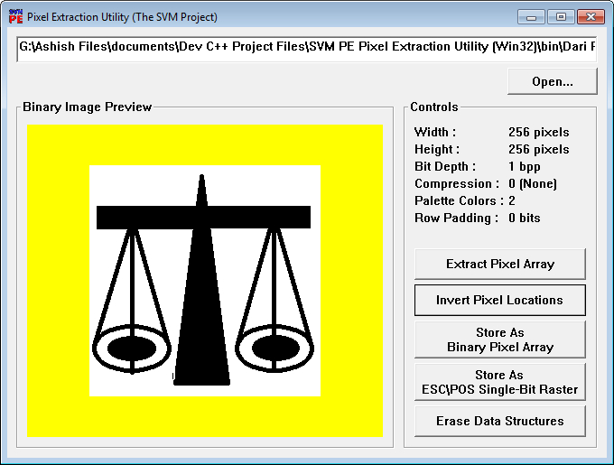

<h1>

SVM PE Pixel Extraction Utility Program
</h1>

A software which can extract <b>Pixel arrays</b> from <b>1-bpp Monochrome Bitmaps</b> and transform those extracted pixel data into <b>ESC\POS Single-bit Rasters</b>.

<h3>Download</h3>
<ul>
<li>
<a href="https://github.com/AKD92/SVM-PE-Pixel-Extraction-Utility-Program/raw/master/bin/SVM_PE_UTIL.EXE">Stand-alone Binary Executable (Win32)
 </a> Compiled using <a href="http://tdm-gcc.tdragon.net/about">TDM-GCC 5.1</a>
</li>
<li>
<a href="/src">Browse for Source Codes in C</a> on GitHub
</li>
</ul>

<h3>Related Links</h3>
<ul>
<li>
<a href="http://content.epson.de/fileadmin/content/files/RSD/downloads/escpos.pdf">ESC/POS at Epson</a>
</li>
<li>
<a href="https://en.wikipedia.org/wiki/Page_description_language">Page Description Language</a>
</li>
</ul>
